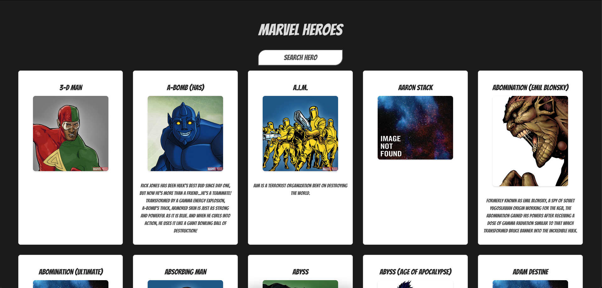

# Marvel Heroes Web App

A web app that allows you to explore Marvel comic characters using the Marvel Comics API. You can search for characters, view their details, and scroll through a list of characters with lazy loading.



## Features

- Search for Marvel comic characters by name.
- View character details such as name, image, and description.
- Lazy loading: Fetch more characters as you scroll down the page.
- Responsive design for a great user experience on different devices.

## Getting Started

1. Clone this repository to your local machine.
2. Install dependencies using npm:

```bash
npm install
``````
3. Run the development server:
```bash
npm run dev
```
Open your browser and navigate to http://localhost:3000 to see the app in action.

## Technologies Used

- **Vite.js:** A fast build tool that offers near-instant development server startup.
- **jQuery:** A fast, small, and feature-rich JavaScript library.
- **Blueimp MD5:** A JavaScript MD5 implementation for hashing data.

## API Usage

The app uses the Marvel Comics API to fetch character data. You need to provide your public and private keys in the code to authenticate API requests.

## Credits

- Marvel Heroes images and data are provided by the Marvel Comics API.
- Fonts used: Google Fonts - Bangers.

## License

This project is licensed under the MIT License - see the LICENSE file for details.
